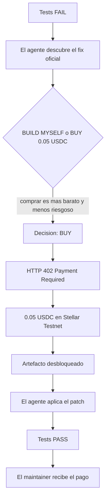

# OSS402

**AI uses upstream. AI pays upstream.**

OSS402 es una capa de monetización nativa para máquinas. El código abierto sigue gratis. Un agente de código puede descubrir, comparar y comprar trabajo oficial del maintainer —en este MVP, un artefacto de compatibilidad— pagando con x402 sobre Stellar Testnet, sin que una persona pulse “comprar”.

> Open source stays free. AI agents can pay maintainers when buying official maintainer work is more rational than recreating it themselves.

**Track:** AI Agents & Automated Workflows · Stellar Odyssey Perú 2026  
**Red:** Stellar Testnet · **Pago:** pay-per-job vía x402 · **Activo:** USDC de test  
**Estado:** documentación de fase 1. La implementación del loop todavía no está en este repo.

## Checkpoint

| Campo | Enlace |
| --- | --- |
| Esquema o flujo | [docs/esquema.md](docs/esquema.md) |
| Repositorio base | https://github.com/hallzyx/oss402 |
| PRD completo | [docs/PRD.md](docs/PRD.md) |

## Problema

Los agentes de código consumen open source y se saltan docs, sponsors y superficies comerciales que sostenían al maintainer. El proyecto sigue creando valor, pero desaparece de la transacción.

## Qué se monetiza

No se cobra el código, la documentación pública, los releases estables ni la instalación normal del paquete.

En el MVP se vende un solo recurso:

**Official Compatibility Artifact** de `fastjson-x` v2.0 para Node.js 28, a **0.05 USDC**.

Incluye `compatibility.patch`, `manifest.json` y `compatibility-report.md`.

## Momento de la demo



La persona no aprueba la compra de 0.05 USDC. El límite autónomo del MVP es 0.10 USDC y el presupuesto de sesión es 1.00 USDC.

## Piezas del MVP

```text
apps/maintainer-dashboard     ingresos y compras de agentes
apps/demo-broken-app          app Node 28 que falla con fastjson-x v2.0
apps/oss402-api               catalogo, 402 y entrega del artefacto
packages/fastjson-x           paquete OSS ficticio, gratis
packages/fastjson-x-node28-artifact
packages/oss402-mcp           discover, inspect, budget, purchase
packages/oss402-client
```

Esa estructura es el plano. Este commit solo trae la documentación.

## Documentos

- [Esquema y flujos](docs/esquema.md) — contexto, arquitectura, secuencia de pago y decisión económica
- [PRD](docs/PRD.md) — requisitos completos del hackathon

## Pitch

OSS402 turns AI agents into paying customers of the open-source maintainers they depend on.
