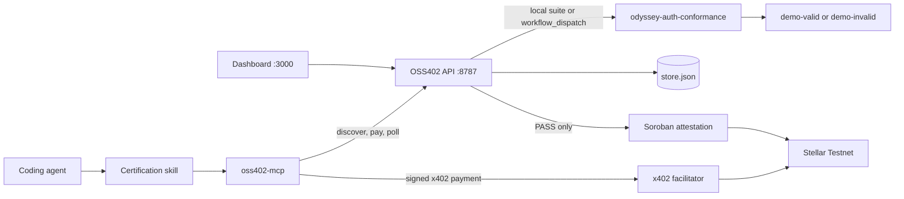
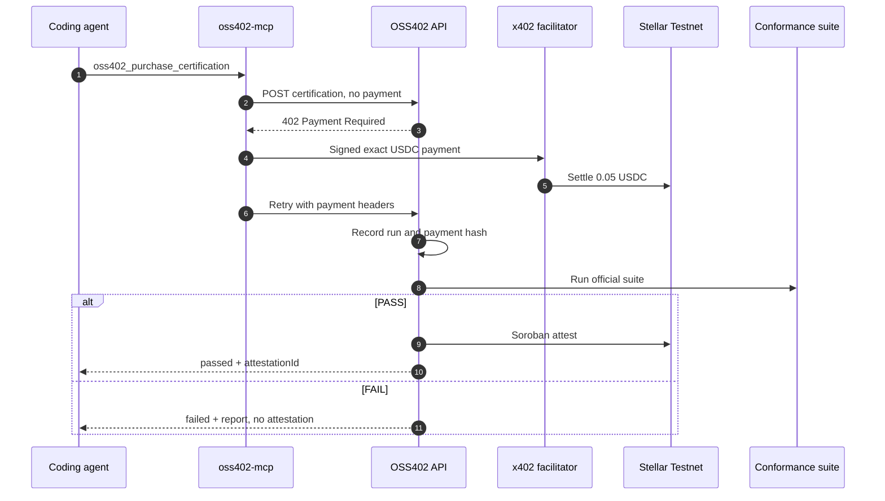

# OSS402 Architecture

OSS402 lets a coding agent buy an official conformance run from the maintainer of a free library. The API is the certification authority. The MCP process is the x402 buyer. Stellar Testnet records the USDC payment and, only after PASS, the maintainer attestation.

## Quick path

1. Read the runtime topology below.
2. Follow the paid request flow to see where settlement and PASS/FAIL split.
3. Use [Configuration](CONFIGURATION.md) for environment variables and [x402 and Stellar](X402_STELLAR.md) for live settlement.

## System context



## Runtime components

| Component | Port | Responsibility | Owns secrets? |
| --- | ---: | --- | --- |
| `apps/dashboard` | 3000 | Public landing, `/verify/:id` credential, `/maintainer` ledger | No |
| `packages/oss402-mcp` | stdio | Discover, inspect, pay, poll, verify | Yes: payer `STELLAR_PRIVATE_KEY` |
| `apps/oss402-api` | 8787 | x402 resource server, run ledger, suite orchestration, PASS attestation | Yes: maintainer address; Soroban identity for writes |
| `packages/odyssey-auth-conformance` | — | Official suite. Public tests and maintainer-only cases | No |
| `apps/demo-valid` | 3001 | Correct `odyssey-auth` integration | No |
| `apps/demo-invalid` | 3002 | Same library with expired tokens accepted | No |
| `contracts/oss402-attestation` | — | Soroban contract that stores a PASS subject | Deployer key, offline |
| Local store | — | Runs, revenue, attestations | File on disk |

### API

The API is the certification authority. It:

- publishes the service catalog at `/.well-known/oss402.json` and `/api/services`;
- charges `POST /api/certifications/odyssey-auth/v1` with x402 exact USDC;
- records the run before the suite finishes, with the settlement hash written after settle;
- runs the suite in-process when `OSS402_RUN_LOCALLY` is not `0`, or dispatches GitHub Actions otherwise;
- issues an attestation only when the suite returns PASS;
- serves verification JSON, the badge SVG, and the maintainer stats.

The dashboard never signs a payment and never receives `STELLAR_PRIVATE_KEY`.

### MCP

The MCP server is the buyer. It reads `oss402.yml`, checks `agent.maxAutonomousPurchaseUSDC`, calls the API, answers the 402 challenge, and returns `runId` plus the settlement hash.

It does not decide PASS or FAIL. It polls the API.

### Conformance suite

`odyssey-auth-conformance` is the thing the maintainer sells the right to run. The demo apps do not grade themselves. The same suite produces 30/30 on `demo-valid` and 29/30 `AUTH-017` on `demo-invalid`.

## Request flows

### Unpaid discovery

1. The agent reads `oss402.yml` and sees `certification.requiredFor: [production]`.
2. `oss402_discover` and `oss402_inspect` read the catalog.
3. No payment is created.

### Paid certification

1. The MCP `POST`s the certification endpoint without a payment signature.
2. The API answers with the x402 `PAYMENT-REQUIRED` challenge for 0.05 USDC on `stellar:testnet`.
3. The MCP signs the exact payment with the payer key and retries.
4. The facilitator settles USDC to `MAINTAINER_STELLAR_ADDRESS`.
5. The API accepts the run, stores `paymentTx` from the settlement result, and starts the suite.
6. PASS writes a Soroban attestation and returns `attestationId`. FAIL stores the report and leaves `attestationId` empty.



Store writes are serialized. The PASS path waits on the Soroban write before the final save, and that save reloads the run so it cannot drop the settlement hash recorded by `onAfterSettle`.

## What the attestation binds

An attestation is not "this repository passed." Both demo apps share a repository and can share a commit. The subject hash includes:

- repository
- commit
- workspace path
- dependency name and version
- suite version
- configuration hash

If the current workspace or commit does not match, verification reports the certification as stale. Stale means this build is not covered. It does not mean the suite failed.

## Policy and money

A purchase is allowed by the skill only when the service price is within `agent.maxAutonomousPurchaseUSDC`. The demo apps set that cap to 0.10 USDC and the session budget to 1.00 USDC. The service price is 0.05 USDC.

| Outcome | USDC settled? | Attestation? |
| --- | ---: | ---: |
| PASS | Yes | Yes, bound to that subject |
| FAIL | Yes | No |
| Purchase blocked by policy or missing payer key | No | No |

## Data ownership

| Data | Source of truth |
| --- | --- |
| Service price and endpoint | API catalog (`odyssey-auth-conformance-v1`) |
| Whether production requires certification | `oss402.yml` in the workspace |
| Run status, report, payment hash | `apps/oss402-api/data/store.json` |
| Attestation subject | Store record plus Soroban contract when a write succeeded |
| Payer key | Root `.env`, read by the MCP process |

## Trust boundaries

- The dashboard and the demo apps are untrusted and never receive signing keys.
- The payer key lives in the MCP process, not in the API and not in the browser.
- The maintainer address receives USDC. The Soroban write uses the maintainer identity configured for the API.
- FAIL cannot be turned into an attestation by paying again for the same broken build. A new run can be purchased after the project changes. Payment of the failed run is not refunded.
- GitHub Actions dispatch is optional. The default local path runs the suite inside the API process so a demo does not depend on a remote workflow.

## Repository map

```text
apps/
  demo-valid/       correct integration
  demo-invalid/     expired tokens accepted
  oss402-api/       certification authority
  dashboard/        landing, credential, ledger
packages/
  odyssey-auth/
  odyssey-auth-conformance/
  oss402-client/
  oss402-mcp/
contracts/
  oss402-attestation/
.agents/skills/oss402-certification/
docs/
```

## Related documents

- [Protocol](PROTOCOL.md)
- [Getting Started](GETTING_STARTED.md)
- [Configuration](CONFIGURATION.md)
- [MCP and Agent Skill](MCP_AND_AGENT_SKILL.md)
- [x402 and Stellar](X402_STELLAR.md)
- [Operations](OPERATIONS.md)
- [Conformance](CONFORMANCE.md)
- [Testing](TESTING.md)
- [Security](SECURITY.md)
- [Product requirements](PRD.md)
