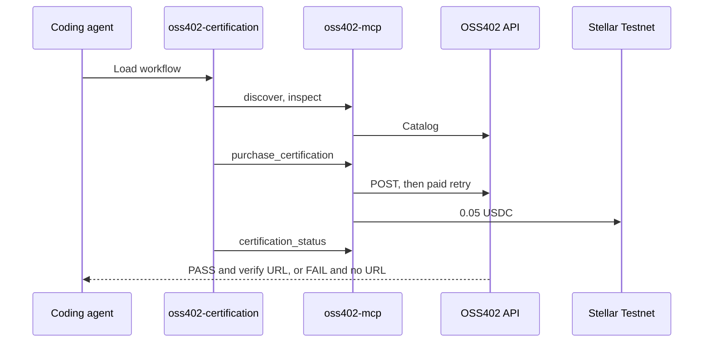

# MCP and Agent Skill

OSS402 exposes a local MCP server and an Agent Skill. The skill decides when a run should be purchased. The MCP server pays and talks to the API.

## Quick path

1. Build `oss402-mcp` so `packages/oss402-mcp/dist/index.js` exists.
2. Open OpenCode at the repository root so `opencode.jsonc` and `.env` resolve.
3. Start a new session and ask it to use the `oss402-certification` skill.
4. Name the workspace as `apps/demo-invalid` or `apps/demo-valid`, not as an absolute path.



## MCP server

`opencode.jsonc` at the repository root:

```jsonc
{
  "$schema": "https://opencode.ai/config.json",
  "mcp": {
    "oss402": {
      "type": "local",
      "command": ["node", "packages/oss402-mcp/dist/index.js"],
      "cwd": ".",
      "enabled": true,
      "timeout": 30000,
      "environment": {
        "OSS402_API_URL": "http://127.0.0.1:8787"
      }
    }
  }
}
```

The command path is relative to `cwd`. OpenCode must be using the repository root as its working directory. `timeout` is 30000 because the first tool call can wait on settlement.

Do not put `STELLAR_PRIVATE_KEY` in this file. The server reads it from `.env`.

Reconnect the MCP server after changing `opencode.jsonc` or rebuilding `dist`.

## Tools

| Tool | Purpose |
| --- | --- |
| `oss402_discover` | List certification services for a dependency and version |
| `oss402_inspect` | Read price, suite, network, and whether PASS issues an attestation |
| `oss402_purchase_certification` | Pay 0.05 USDC and create a run |
| `oss402_certification_status` | Poll until `passed` or `failed` |
| `oss402_verify_attestation` | Read the attestation and whether the subject still matches |

`oss402_purchase_certification` arguments that the skill must send:

| Argument | Value |
| --- | --- |
| `serviceId` | `odyssey-auth-conformance-v1` |
| `workspace` | `apps/demo-invalid` or `apps/demo-valid` |
| `repository` | `github.com/hallzyx/oss402` |
| `commit` | Git SHA, or a short label when you asked for one |

An absolute Windows path is rejected by the skill instructions because the runner resolves `workspace` from the repository root.

On PASS the tool result includes `transactionHash` when the facilitator returned one. On FAIL there is a payment hash and no `attestationId`.

## Agent Skill

The skill file is `.agents/skills/oss402-certification/SKILL.md`.

OpenCode discovers `.agents/skills` and loads the full skill when the session uses the skill tool. `AGENTS.md` is the short contract loaded with the repository. It does not replace the skill.

The skill requires the agent to:

- finish ordinary tests before buying a run;
- stay inside `maxAutonomousPurchaseUSDC`;
- treat payment as purchase of a run, not as PASS;
- on FAIL, explain the report and not invent a `/verify/` URL;
- on PASS, print `http://localhost:3000/verify/{attestationId}` on its own line, plus the payment hash.

## What to ask the agent

With the API already running:

```text
Use the oss402-certification skill to certify apps/demo-invalid.
```

After that result, in a separate request and without editing demo source:

```text
Use the oss402-certification skill to certify apps/demo-valid.
```

Expected official results:

| Workspace | Suite | Credential URL |
| --- | --- | --- |
| `apps/demo-invalid` | 29/30 FAIL `AUTH-017` | None |
| `apps/demo-valid` | 30/30 PASS | `http://localhost:3000/verify/{attestationId}` |

## Shell alternative

You can buy the same run without an agent:

```bash
pnpm pay:certify apps/demo-valid <commit-sha>
```

The script uses the same payer key and the same API. It does not apply the skill's chat formatting. Read the JSON it prints.

## Related documents

- [Configuration](CONFIGURATION.md)
- [Security](SECURITY.md)
- [x402 and Stellar](X402_STELLAR.md)
- [Getting Started](GETTING_STARTED.md)
