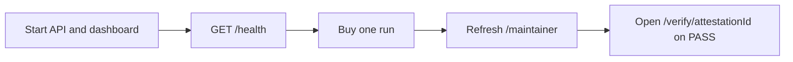

# Operations

This guide covers the local processes, the ledger, and how to read a credential after a run.

## Quick path

```bash
pnpm dev:api
pnpm dev:dashboard
```

Then open http://localhost:3000/maintainer.



## Service health

| Service | Check |
| --- | --- |
| API | `GET http://127.0.0.1:8787/health` |
| Manifest | `GET http://127.0.0.1:8787/.well-known/oss402.json` |
| Dashboard | `GET http://localhost:3000/` |

`/health` reports whether `MAINTAINER_STELLAR_ADDRESS` is set, the network, and the price. It does not report the payer key.

## Surfaces

| Screen | URL | What it shows |
| --- | --- | --- |
| Landing | `/` | Public explanation of pay-per-run |
| Maintainer | `/maintainer` | Run count, pass, fail, revenue, transaction table |
| Credential | `/verify/:id` | Badge, subject, payment is not shown here as the USDC hash |
| Badge alias | `/badge/:id` | Redirects to `/verify/:id` |

On the maintainer table:

- Payment is the USDC settlement hash. A 64-hex value links to Stellar Expert.
- Credential is the attestation id. Its second line is the Soroban transaction, when one exists.
- A FAIL row has a payment link and an em dash in Credential.

## Ledger file

The API stores runs in `apps/oss402-api/data/store.json` when started via `pnpm dev:api`. Override the directory with `OSS402_DATA_DIR`.

Useful reads, without spending:

```http
GET /api/stats
GET /api/certifications
GET /api/certifications/cert_8
GET /api/attestations/att_5
```

`/api/certifications` returns newest runs first and joins `stellarTx` from the attestation onto each run.

Do not commit `store.json` if it is only your local ledger. The reference hashes in the README were copied from Testnet, not from a requirement to publish the file.

## Local run versus GitHub Actions

`OSS402_RUN_LOCALLY` defaults to on. The API runs `odyssey-auth-conformance` against the workspace path after payment.

Set `OSS402_RUN_LOCALLY=0` and provide `GITHUB_TOKEN` plus `GITHUB_REPOSITORY` to dispatch `oss402-certification.yml` instead. The workflow must call back to `/api/certifications/:runId/callback`. If `OSS402_CALLBACK_SECRET` is set, the callback must send it as `x-oss402-callback-secret`.

## Logs

The API process prints certification failures as `[oss402-api] certification <runId> failed`. A payer failure before 200, such as a missing key or a 402 the client could not settle, does not create a run.

## Credential check

For a PASS id:

1. Open `/verify/<attestationId>`.
2. Confirm the workspace and commit match the run you bought.
3. Use the on-chain hash link when the page shows one.
4. Compare that hash with the Payment hash on `/maintainer`. They should differ: one moved USDC, the other wrote the attestation.

## Related documents

- [Getting Started](GETTING_STARTED.md)
- [x402 and Stellar](X402_STELLAR.md)
- [Testing](TESTING.md)
