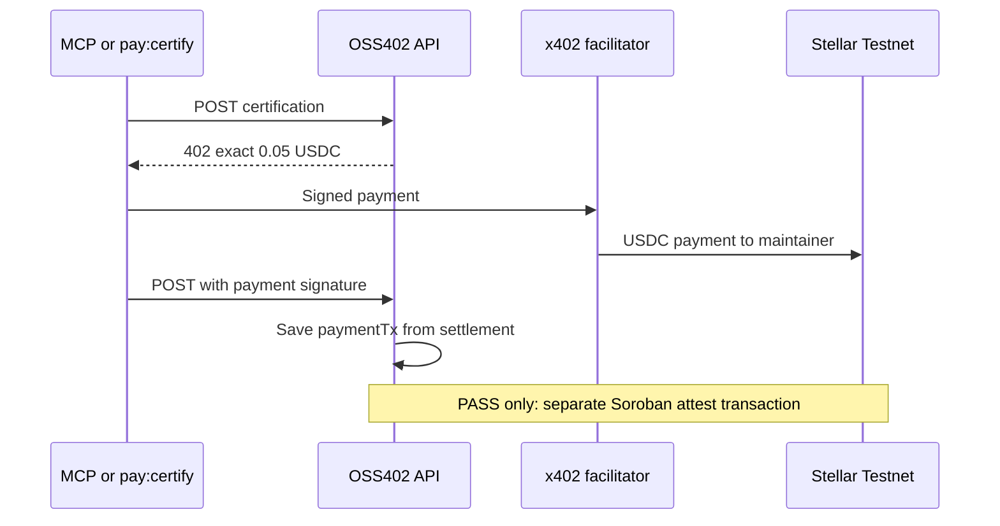

# x402 and Stellar Settlement

This document is the payment path for one official certification run.

## Quick path

1. Fund a payer account on Stellar Testnet with XLM for fees and USDC for the 0.05 charge.
2. Give the maintainer account a USDC trustline. Put only its `G...` address in `MAINTAINER_STELLAR_ADDRESS`.
3. Put the payer secret in `STELLAR_PRIVATE_KEY`.
4. Start the API.
5. Buy one run and open the settlement transaction on Stellar Expert.

## Submission evidence

These Stellar Testnet transactions are the reference evidence for the hackathon demo. They are real settlements, not placeholders.

| Evidence | What it proves | Stellar Expert |
| --- | --- | --- |
| Contract `CAHOYKJPZNQ73XH3WCW7KLKWYT3SIHWL3UNEVTDNIMRQPIQMYBAVBMSI` | PASS attestations are written here | [Contract](https://stellar.expert/explorer/testnet/contract/CAHOYKJPZNQ73XH3WCW7KLKWYT3SIHWL3UNEVTDNIMRQPIQMYBAVBMSI) |
| Deploy `476a836d8a3f01a4109096baa98147be833c0b6f4931f46d5655b9f3bc08d0b8` | Contract deployment | [Transaction](https://stellar.expert/explorer/testnet/tx/476a836d8a3f01a4109096baa98147be833c0b6f4931f46d5655b9f3bc08d0b8) |
| `3081b8c198cd60d3f453e7c2bb2a737eeb742ad35e20d2bfb35712cdfd38d275` | `cert_7`, `apps/demo-invalid`, FAIL, 0.05 USDC, no attestation | [Payment](https://stellar.expert/explorer/testnet/tx/3081b8c198cd60d3f453e7c2bb2a737eeb742ad35e20d2bfb35712cdfd38d275) |
| `8f64518bd223b08a88d36d3f1a4d74baf5872dfb6de73487b2d1d862d959d851` | `cert_8`, `apps/demo-valid`, PASS, 0.05 USDC payment | [Payment](https://stellar.expert/explorer/testnet/tx/8f64518bd223b08a88d36d3f1a4d74baf5872dfb6de73487b2d1d862d959d851) |
| `b7c9e45add1fc46c01556f1b977c868a01ff13784e46b101840116bbba393420` | `att_5` Soroban attestation write for that PASS | [Attestation](https://stellar.expert/explorer/testnet/tx/b7c9e45add1fc46c01556f1b977c868a01ff13784e46b101840116bbba393420) |

The maintainer account that received the USDC is `GAGFYNO73QSTBD5NBJ5DTJ3GSWGA255VZ4W5CJ2Q2WIEEC2MN6FVFB2T`.

The payment hash and the attestation hash are different transactions. The maintainer ledger shows the payment in the Payment column and the attestation hash under the credential id.

## Roles

| Role | Component | Responsibility |
| --- | --- | --- |
| Resource server | OSS402 API | Advertises 0.05 USDC and runs the suite after settlement |
| Buyer | MCP or `pay:certify` | Signs the x402 exact payment |
| Facilitator | `https://www.x402.org/facilitator` | Submits and reports settlement |
| Ledger | `store.json` | Stores the run, the payment hash, and any attestation |
| Settlement network | Stellar Testnet | Records the USDC transfer and the Soroban write |

The dashboard is not a payer.

## Required configuration

```dotenv
X402_FACILITATOR_URL=https://www.x402.org/facilitator
MAINTAINER_STELLAR_ADDRESS=G...
STELLAR_PRIVATE_KEY=S...
ATTESTATION_CONTRACT_ID=CAHOYKJPZNQ73XH3WCW7KLKWYT3SIHWL3UNEVTDNIMRQPIQMYBAVBMSI
```

The price the client pays must match the price the API advertises: 0.05 USDC, scheme `exact`, network `stellar:testnet`, `payTo` equal to the maintainer address.

## HTTP-visible flow

### Challenge

```http
POST /api/certifications/odyssey-auth/v1
Content-Type: application/json

{
  "repository": "github.com/hallzyx/oss402",
  "commit": "<sha-or-label>",
  "workspace": "apps/demo-valid",
  "dependency": "odyssey-auth@1.0.0"
}
```

Without a payment signature the response is 402 and a payment-required challenge.

### Settlement retry

The buyer retries the same POST with the x402 payment signature headers. After the facilitator settles, the API responds 200:

```json
{
  "runId": "cert_8",
  "status": "queued",
  "paid": "0.05 USDC"
}
```

The settlement hash is not in that JSON body. The buyer reads it from the `PAYMENT-RESPONSE` header. The API stores the same hash from `onAfterSettle` onto `run.paymentTx`.

### After the suite

Poll:

```http
GET /api/certifications/{runId}
```

PASS includes `attestationId`. FAIL includes `report.code` and does not include an attestation id. Both include `paymentTx` when settlement was recorded.



## Amounts

| Item | Display | Asset |
| --- | ---: | --- |
| One certification run | 0.05 USDC | Stellar Testnet USDC |
| Demo autonomous cap | 0.10 USDC | Policy in `oss402.yml`, not a chain limit |
| Demo session budget | 1.00 USDC | Policy in `oss402.yml` |

A FAIL costs the same 0.05 USDC as a PASS. The price includes the initial attempt and one remediation retry. The retry is part of the purchased run. It is not a second charge.

## Related documents

- [Configuration](CONFIGURATION.md)
- [Operations](OPERATIONS.md)
- [Security](SECURITY.md)
- [Architecture](ARCHITECTURE.md)
