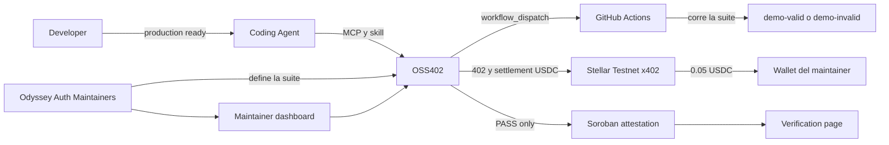
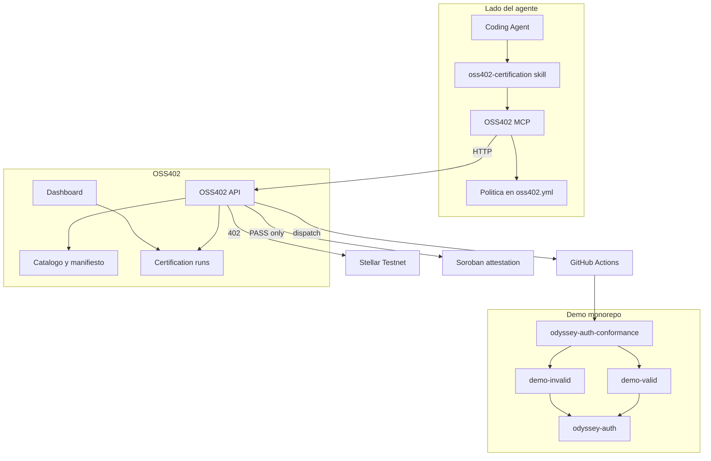
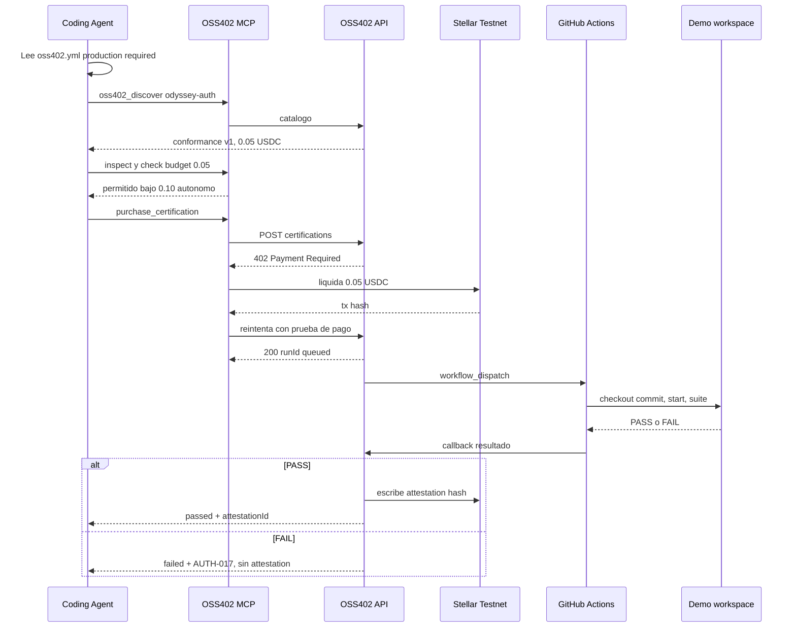
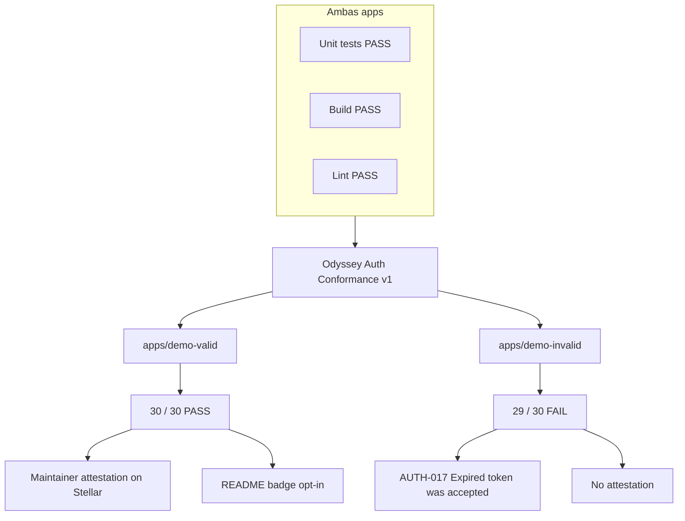
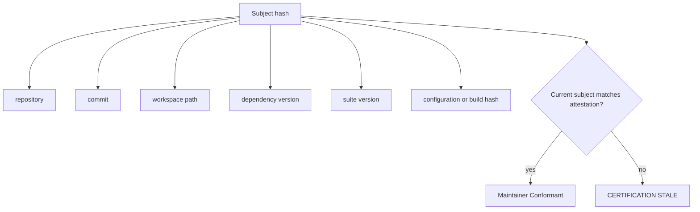

# Esquema OSS402

Qué construye el MVP: un agente lee la política de producción, compra una corrida de certificación oficial de `odyssey-auth` por 0.05 USDC con x402 en Stellar Testnet, GitHub Actions ejecuta la suite sobre el workspace exacto, y solo un PASS escribe una atestación del maintainer. El pago no compra un certificado.

Biblioteca demo: `odyssey-auth` v1.0.0. Apps: `demo-valid` (PASS) y `demo-invalid` (FAIL `AUTH-017`).

## 1. Contexto

El código, los docs y el release estable de `odyssey-auth` siguen gratis. OSS402 vende la autoridad de correr la suite oficial y atestar el resultado.

## 2. Contenedores

Herramientas MCP:

| Tool | Para qué |
| --- | --- |
| `oss402_discover` | Servicios de certificación de una dependencia |
| `oss402_inspect` | Precio, suite, si emite atestación |
| `oss402_purchase_certification` | 402, pago, `runId` |
| `oss402_certification_status` | running / passed / failed |
| `oss402_verify_attestation` | Metadata y validez del sujeto |

## 3. Secuencia: pago, suite, PASS o FAIL

## 4. Contraste de las dos apps

Misma librería, misma suite, mismo workflow. Solo cambia la configuración.

Esto prueba que el pago no garantiza aprobación y que la suite evalúa el proyecto, no un resultado hardcodeado.

## 5. Binding de la atestación y stale

La atestación no se ata solo a `repository + commit`. Las dos demos viven en el mismo repo y pueden compartir commit.

Stale significa: este build no está certificado. No significa que falló la certificación.

## 6. Precio y política

| Concepto | Valor |
| --- | --- |
| Precio por corrida | 0.05 USDC |
| Incluye | intento inicial + 1 remediation retry |
| Límite autónomo | 0.10 USDC |
| Presupuesto de sesión | 1.00 USDC |
| Red | stellar-testnet |

Detalle de requisitos: [PRD.md](PRD.md).
