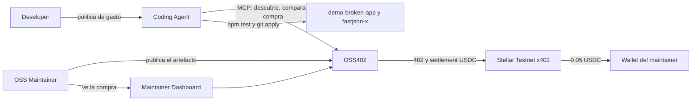
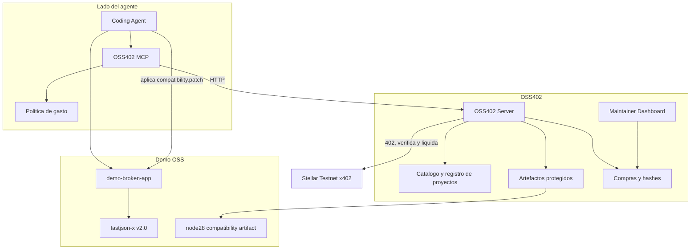
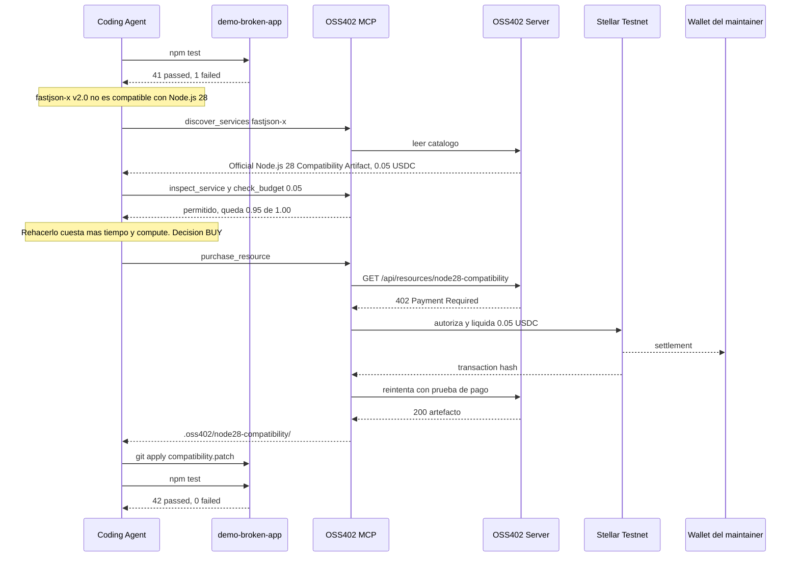
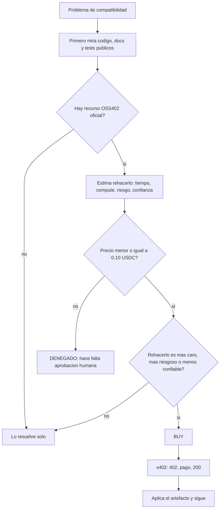

# Esquema OSS402

Qué vamos a construir en el MVP: un agente descubre un artefacto oficial de compatibilidad, decide comprarlo porque sale más barato que rehacerlo, paga 0.05 USDC con x402 en Stellar Testnet, aplica el patch y los tests pasan. El maintainer cobra.

Paquete demo: `fastjson-x` v2.0. Runtime roto a propósito: Node.js 28.

## 1. Contexto

Quién habla con el sistema y qué queda fuera.



El código, los docs públicos y el release estable de `fastjson-x` siguen gratis. OSS402 solo vende el trabajo extra del maintainer.

## 2. Contenedores



Herramientas MCP del MVP:

| Tool | Para qué |
| --- | --- |
| `discover_services` | Lista servicios de un proyecto, por ejemplo `fastjson-x` |
| `inspect_service` | Precio, publisher, runtime objetivo y resultado esperado |
| `wallet_balance` | Saldo USDC de la wallet del agente |
| `check_budget` | Compara el precio contra el límite autónomo |
| `purchase_resource` | Pide el recurso, paga el 402 y guarda el artefacto |

Manifiesto público del proyecto, sin pago: `/.well-known/oss402.json`.

Recurso protegido: `GET /api/resources/node28-compatibility`. Sin pago responde `402`. Con prueba de pago válida responde `200` y entrega el artefacto.

## 3. Flujo de la demo

Objetivo de pitch: unos 90 segundos. Nadie pulsa un botón de compra.



Timing previsto:

| Tiempo | Qué se ve |
| --- | --- |
| 0:00–0:10 | El problema: la IA usa upstream y el maintainer no cobra |
| 0:10–0:20 | `npm test` falla |
| 0:20–0:35 | Descubre el artefacto oficial |
| 0:35–0:50 | Compara rehacerlo contra comprarlo |
| 0:50–1:05 | Pago x402 en Stellar y hash visible |
| 1:05–1:20 | Aplica el patch |
| 1:20–1:30 | Tests en verde y +0.05 USDC en el dashboard |

## 4. Decisión económica

El agente compra solo si el precio cabe en el límite autónomo y rehacerlo sale peor: más caro, más riesgoso, o con menos confianza que el artefacto oficial.



Ejemplo del caso demo:

| Opción | Costo | Riesgo | Confianza |
| --- | --- | --- | --- |
| Rehacer el patch | ~15–20 min, ~0.20–0.30 USD de compute | Medio | ~0.72 |
| Comprar el artefacto oficial | 0.05 USDC | Bajo, lo respalda el maintainer | ~0.98 |

Decisión: comprar. El límite autónomo es 0.10 USDC, así que no pide confirmación.

Por encima del límite, por ejemplo 3.00 USDC, el MCP rechaza la compra y pide aprobación humana. En el MVP esa política vive en el MCP. Smart accounts de Stellar quedan como stretch.

## 5. Artefacto que se entrega

```text
fastjson-node28-compat/
├── compatibility.patch
├── manifest.json
└── compatibility-report.md
```

`manifest.json` declara proyecto, versión pública `2.0.0`, runtime `node` 28, tipo `official_compatibility_patch`, publisher y hash.

## 6. Dashboard del maintainer

Después del pago se ve, como mínimo:

```text
OSS402
fastjson-x
Revenue          0.05 USDC
AI consumers     1
Node 28 Compatibility Artifact
0.05 USDC · 1 purchase
```

Gráficos, saldo y ranking de recursos son opcionales. No son parte del loop que hay que cerrar primero.

## 7. Qué no entra en el MVP

No es un marketplace de paquetes, ni un paywall del repo, ni donaciones, ni docs de pago, ni un token, ni reparto de revenue entre dependencias, ni mainnet.

El criterio de cierre es un solo loop fiable: tests rojos, descubrimiento, comparación, 402, settlement en Stellar Testnet, artefacto aplicado, tests verdes, hash visible y dashboard actualizado.

Detalle de requisitos, manifiesto, criterios de aceptación y stretch goals: [PRD.md](PRD.md).
